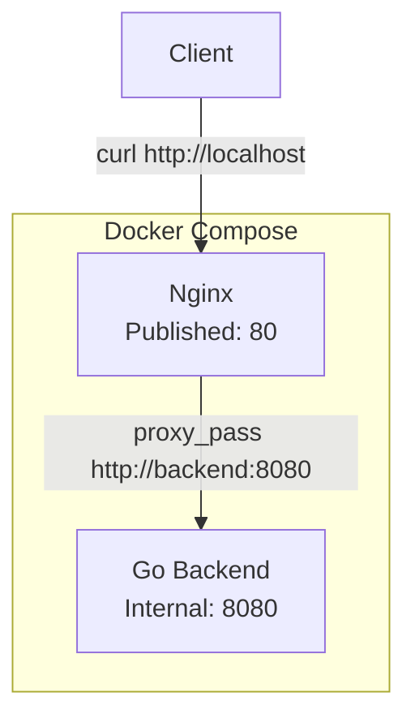

# em_test
DevOps take home assignment

## Как запустить проект
- Склонировать проект
- Перейти в директорию `em_test`
- Выполнить в консоли комманду
```bash
docker compose up
```

## Как проверить результат
- Проверить, что контейнеры запустились и работают
```bash
docker ps
```

- Выполнить запрос на `http://localhost`. В ответе должна быть строка `Hello from Effective Mobile!`
```bash
curl http://localhost
```

## Как остановить проект
- Перейти в директорию `em_test`
- Выполнить в консоли комманду
```bash
docker compose down
```

## Как работает схема
Клиент делает запрос на реверс прокси (NGinx), прокси перенаправляет запрос на бекэнд.
Бэкэнд не доступен клиенту напрямую, а видим только внутри докер сети.


